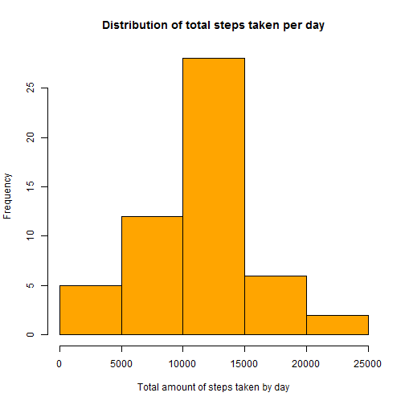
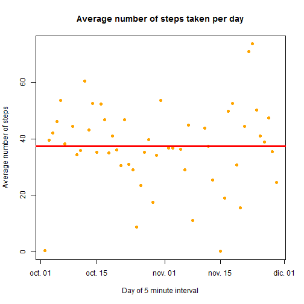
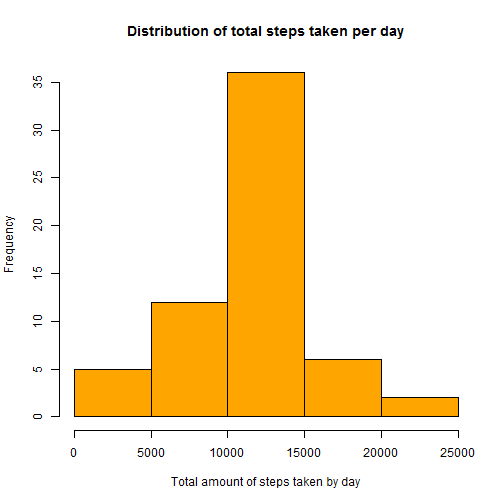
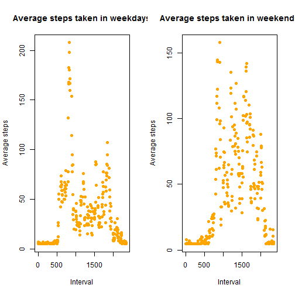

# Peer Assessment 1

Here I show the procedure I took to complete the Peer Assessment 1 of the Reproducible Research course from the Johns Hopkins University at Coursera.

The steps shown below were taken after having forked rdpeng's original repository at GitHub that contains all the needed files for the assignment.


First of all, I changed the working directory in my PC to the place where I had cloned the repo I just forked:


```r
setwd("C:/Users/CarlosDaniel/SkyDrive/Documentos/Tec de Monterrey/zCoursera/5. Reproducible Research/RepData_PeerAssessment1")
```

## 1. Loading and preprocessing the data
Now that we're in the correct directory, we load the data from the .zip file by using the unzip() function to unzip it, and then we use the read.csv() function to assign the data to the variable "data". Here's the code for the procedure:


```r
unzip("activity.zip")
data <- read.csv("activity.csv")

head(data)
```

```
##   steps       date interval
## 1    NA 2012-10-01        0
## 2    NA 2012-10-01        5
## 3    NA 2012-10-01       10
## 4    NA 2012-10-01       15
## 5    NA 2012-10-01       20
## 6    NA 2012-10-01       25
```

We convert the data column from factor (which was by default) to character, and then to the date using its format.


```r
data$date <- as.character(data$date)
data$date <- as.Date(data$date, format = "%Y-%m-%d")

str(data)
```

```
## 'data.frame':	17568 obs. of  3 variables:
##  $ steps   : int  NA NA NA NA NA NA NA NA NA NA ...
##  $ date    : Date, format: "2012-10-01" "2012-10-01" ...
##  $ interval: int  0 5 10 15 20 25 30 35 40 45 ...
```

## 2. What is the mean number of steps taken per day?
For this part of the assessment, we ignore the missing values in the dataset.

First, we calculate the total number of steps taken per day by grouping the data by the date column and applying the sum() function to get the total. All of this is done in a single line of code with the aggregate() function:


```r
res <- aggregate(data$steps ~ data$date, data, sum)
names(res) <- c("date", "steps")

head(res)
```

```
##         date steps
## 1 2012-10-02   126
## 2 2012-10-03 11352
## 3 2012-10-04 12116
## 4 2012-10-05 13294
## 5 2012-10-06 15420
## 6 2012-10-07 11015
```

In this histogram you can see the total number of steps taken each day:


```r
hist(res$steps, xlab = "Total amount of steps taken by day", main = "Distribution of total steps taken per day", col = "orange")
```

 

Now, we compute the mean and median of the data shown in the histogram with this code:


```r
themean <- round(mean(res$steps))
themedian <- median(res$steps)
```

Therefore, the rounded mean of the data is 1.0766 &times; 10<sup>4</sup> and the median is 10765.

## 3. What is the average daily activity pattern?
The next code makes a time series plot, of the 5-minute interval (x-axis) and the average number of steps taken, averaged across all days (y-axis). For this, a new vector called resavg is needed, to get the average number of steps, instead of the totals, which are stored in the existent 'res' variable.


```r
resavg <- aggregate(data$steps ~ data$date, data, mean)
names(resavg) <- c("date", "steps")

plot(resavg$date, resavg$steps, pch = 16, col = "orange", xlab = "Day of 5 minute interval", ylab = "Average number of steps", main = "Average number of steps taken per day")
abline(h = mean(resavg$steps), lwd = 3, col = "red")
```

 

```r
meansteps <- round(mean(resavg$steps))
maxsteps <- resavg$date[resavg$steps == max(resavg$steps)]
```

As you can see in the code, there's a horizontal line that points to where the average of the whole data is.

The 5-minute interval, on average across all the days in the dataset, that contains the maximum number of steps is in 2012-11-23.

## 4. Imputing missing values
As the presence of missing days may introduce bias into some calculations or summaries of the data, we calculate and report the total number of missing values in the initial dataset.


```r
narows <- nrow(data[is.na(data$steps), ])
narows
```

[1] 2304

To minimize the effect of missing values in the data analysis, we devise a strategy for filling in all of the missing values in the dataset, by simply adding the mean value of the average number of steps for each day. We assigned this value to 'meansteps', and you can find it in the code chunk of the step 3 in this report. The rounded value is 37.

Based on this, we create a new dataset that is equal to the original dataset but with the missing data filled in.


```r
nonas <- data
nonas[is.na(nonas)] <- meansteps
```

As with the original dataset, we make a histogram of the total number of steps taken each day, calculate, and report the mean and median total number of steps taken per day:


```r
res2 <- aggregate(nonas$steps ~ nonas$date, nonas, sum)
names(res2) <- c("date", "steps")

hist(res2$steps, xlab = "Total amount of steps taken by day", main = "Distribution of total steps taken per day", col = "orange")
```

 

```r
themean2 <- mean(res2$steps)
themedian2 <- median(res2$steps)
```
 
Comparing the results from this histogram to the previous one that included missing values, we can see that the values differ, in both the mean and the median. The previous median was 10765, while in this new dataset we got 1.0656 &times; 10<sup>4</sup>, and we had 1.0766 &times; 10<sup>4</sup> as the mean, but by replacing NAs we get 1.0751738 &times; 10<sup>4</sup>. Therefore, imputing missing data on the estimates gives a decreased value, but a more precise one too.

## 5. Are there differences in activity patterns between weekdays and weekends?
For this section, we use the dataset with the filled-in missing values.

First, we create a new factor variable in the dataset with two levels - "weekday" and "weekend" indicating whether a given date is a weekday or weekend day. This is done with the mutate() function, found inside the 'dplyr' library. Inside of it, we use the weekdays() function in order to set the appropriate level to the new factor.


```r
library(dplyr)
```

```
## Warning: package 'dplyr' was built under R version 3.1.3
```

```
## 
## Attaching package: 'dplyr'
## 
## The following object is masked from 'package:stats':
## 
##     filter
## 
## The following objects are masked from 'package:base':
## 
##     intersect, setdiff, setequal, union
```

```r
nonas <- mutate(nonas, dayofweek = ifelse(weekdays(nonas$date, abbreviate = FALSE) %in% c("sábado", "domingo"), "weekend", "weekday"))
```

Finally, we Make a panel plot containing a time series plot (i.e. type = "l") of the 5-minute interval (x-axis) and the average number of steps taken, averaged across all weekday days or weekend days (y-axis).

For this, the dataset is separated by the 'dayofweek' column, into 'wddata' and 'wedata' (weekday and weekend, respectively). Then, for each the aggregate() function is used to get the average number of steps taken for each interval, and lastly the plots are made, as shown in this code:


```r
par(mfrow = c(1, 2))

wddata <- nonas[nonas$dayofweek == "weekday", ]
wedata <- nonas[nonas$dayofweek == "weekend", ]

wdavg <- aggregate(wddata$steps ~ wddata$interval, wddata, mean)
names(wdavg) <- c("interval", "steps")
weavg <- aggregate(wedata$steps ~ wedata$interval, wedata, mean)
names(weavg) <- c("interval", "steps")

## First the data in the weekdays
plot(wdavg$interval, wdavg$steps, xlab = "Interval", ylab = "Average steps", main = "Average steps taken in weekdays",  pch = 16, col = "orange")
plot(weavg$interval, weavg$steps, xlab = "Interval", ylab = "Average steps", main = "Average steps taken in weekends",  pch = 16, col = "orange")
```

 
